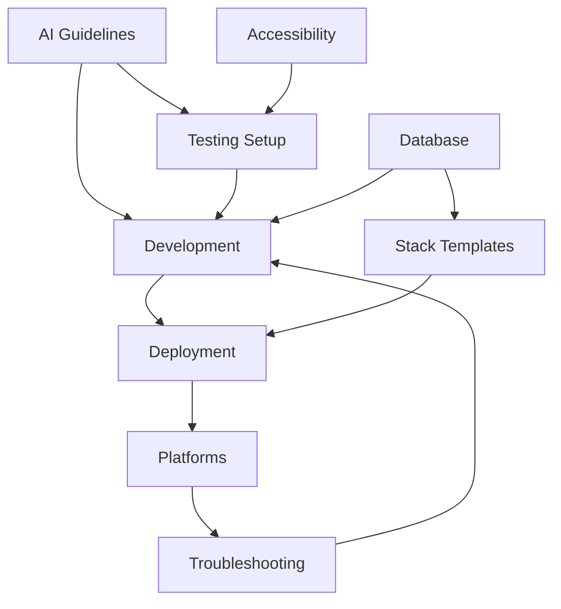

# Project Documentation Index

## Core Development Guides

### 1. [AI Guidelines](00_ai_guidelines.md)
- AI development principles and practices
- Integration patterns and tooling
- AI-driven testing strategies
- Security considerations
> **Key Dependencies:** Testing setup, Development workflow, Stack templates

### 2. [Project Setup](01_project_setup.md)
- Initial project configuration
- Development environment setup
- Core dependencies management
- Project structure
> **Key Dependencies:** Development workflow, Testing setup, Deployment

### 3. [Testing Setup](02_testing_setup.md)
- Testing strategies and frameworks
- Test automation setup
- Coverage requirements
- Integration testing
> **Key Dependencies:** AI guidelines, Development workflow, Accessibility testing

### 4. [Development and Maintenance](03_development_and_maintenance.md)
- Version control workflow
- Code review process
- Maintenance procedures
- Quality assurance
> **Key Dependencies:** Project setup, Testing setup, Deployment, Troubleshooting

## Deployment and Operations

### 5. [Deployment Guide](04_deployment.md)
- Deployment processes
- Environment configuration
- Release procedures
- Rollback strategies
> **Key Dependencies:** Stack templates, Deployment platforms, Troubleshooting

### 6. [Deployment Platforms](09_deployment_platforms.md)
- Platform-specific configurations
- Cloud service setup
- Infrastructure management
- Scaling strategies
> **Key Dependencies:** Deployment guide, Stack templates, Troubleshooting

### 7. [Troubleshooting](10_troubleshooting.md)
- Monitoring solutions
- Problem diagnosis
- Recovery procedures
- Performance optimization
> **Key Dependencies:** Deployment guide, Stack templates, Development workflow

## Technical Standards

### 8. [Accessibility and i18n](07_accessibility_i18n.md)
- Accessibility requirements
- Internationalization setup
- Testing procedures
- Compliance guidelines
> **Key Dependencies:** Testing setup, Development workflow, AI guidelines

### 9. [Stack Templates](13_stack_templates.md)
- Technology stack configurations
- Container orchestration
- Service templates
- YAML configuration
> **Key Dependencies:** Project setup, Deployment platforms, Database migrations

### 10. [Database Migrations](14_database_migrations.md)
- Migration strategies
- Schema management
- Data transformation
- Version control
> **Key Dependencies:** Stack templates, Development workflow, Troubleshooting

## Documentation Map

## Quick Reference

### Development Lifecycle
1. Setup: [Project Setup](01_project_setup.md)
2. Development: [Development and Maintenance](03_development_and_maintenance.md)
3. Testing: [Testing Setup](02_testing_setup.md)
4. Deployment: [Deployment Guide](04_deployment.md)
5. Maintenance: [Troubleshooting](10_troubleshooting.md)

### Technology Stack
1. Templates: [Stack Templates](13_stack_templates.md)
2. Platforms: [Deployment Platforms](09_deployment_platforms.md)
3. Database: [Database Migrations](14_database_migrations.md)

### Quality Assurance
1. AI Testing: [AI Guidelines](00_ai_guidelines.md)
2. Accessibility: [Accessibility and i18n](07_accessibility_i18n.md)
3. Monitoring: [Troubleshooting](10_troubleshooting.md)

## Common Workflows

### 1. New Feature Development
1. Review [Development and Maintenance](03_development_and_maintenance.md)
2. Follow [Testing Setup](02_testing_setup.md)
3. Consider [AI Guidelines](00_ai_guidelines.md)
4. Check [Accessibility and i18n](07_accessibility_i18n.md)

### 2. Deployment Process
1. Follow [Deployment Guide](04_deployment.md)
2. Review [Deployment Platforms](09_deployment_platforms.md)
3. Monitor using [Troubleshooting](10_troubleshooting.md)

### 3. Database Changes
1. Follow [Database Migrations](14_database_migrations.md)
2. Review [Stack Templates](13_stack_templates.md)
3. Update [Development and Maintenance](03_development_and_maintenance.md)

## Maintenance Schedule

### Daily
- Review logs ([Troubleshooting](10_troubleshooting.md))
- Monitor performance ([Deployment Platforms](09_deployment_platforms.md))
- Check alerts ([Development and Maintenance](03_development_and_maintenance.md))

### Weekly
- Update dependencies ([Project Setup](01_project_setup.md))
- Review security ([AI Guidelines](00_ai_guidelines.md))
- Test accessibility ([Accessibility and i18n](07_accessibility_i18n.md))

### Monthly
- Database maintenance ([Database Migrations](14_database_migrations.md))
- Infrastructure review ([Stack Templates](13_stack_templates.md))
- Documentation updates (All guides)
